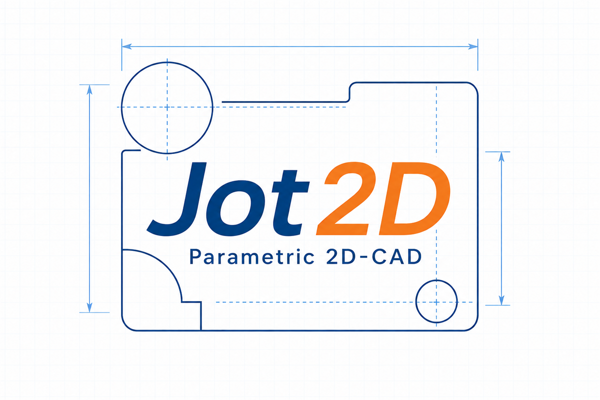

# Jot2D

  

Jot2Dは、ブラウザ上で動作する開発中の2DパラメトリックCADです。
Geometry、Constraint、Sketch階層、Block、Parameter、Hatch、Annotationを、1つのCanvas上で作成・編集できます。

## ブラウザで試す

インストールせずに、次のGitHub PagesからJot2D(α版)を試すことができます。

**[GitHub PagesでJot2D(α版)を試す](https://mssei1515.github.io/cad/)**

> [!WARNING]
> Jot2Dは現在開発中です。予期しない動作やバグが残っており、保存データの破損・消失が発生する可能性があります。重要な作業へ使用する場合は、データをこまめに保存し、必ず別の場所にもバックアップしてください。

## 主な機能

- Point、Line、Circle、Arc、Splineの作図と編集
- 幾何拘束、拘束寸法、参照寸法
- Document／Block DefinitionごとのParameterと数式
- 階層化されたSketchとBlock Definition／Instance
- 閉領域を追従する平行線、クロス、塗りつぶしHatch
- 引出線と自由テキストによるAnnotation
- Geometry、補助線、寸法、Hatch、AnnotationのAppearance設定
- Undo／Redo、Copy／Cut／Paste
- `.jot2d`ファイルの開く、上書き保存、名前を付けて保存

`.jot2d`ファイルの内容にはJSONを使用しています。現行のデータ形式と機能の詳細は、[仕様書](./spec/README.md)を参照してください。

## 免責事項

Jot2Dは現在開発中であり、現状有姿（"as is"）で提供されます。動作、正確性、データの互換性、継続的な利用可能性、特定目的への適合性を含め、いかなる保証もありません。

本ソフトウェアを利用する場合は、重要なデータを事前にバックアップし、作成された図面、寸法、計算結果などが目的に適合することを利用者自身で確認してください。本ソフトウェアの利用によって生じた損害、データの消失、利益の損失、その他の損失について、著作権者は責任を負いません。

ブラウザ、OS、File System Access APIなどの実行環境によって、一部機能が利用できない場合があります。

## License

Copyright (c) 2026 Jot2D. All rights reserved.

個人、教育、評価、その他の非商用目的での利用を許可しています。また、Jot2Dを業務で使用して図面などの成果物を作成することは可能です。一方、ソフトウェアまたはソースコードの販売、商用再配布、他の商用製品・有料サービスへの組み込み、派生版の商用配布、および許可のない改変・再配布は認められていません。

この説明は概要です。正式な利用条件は[LICENSE](./LICENSE)を確認してください。
