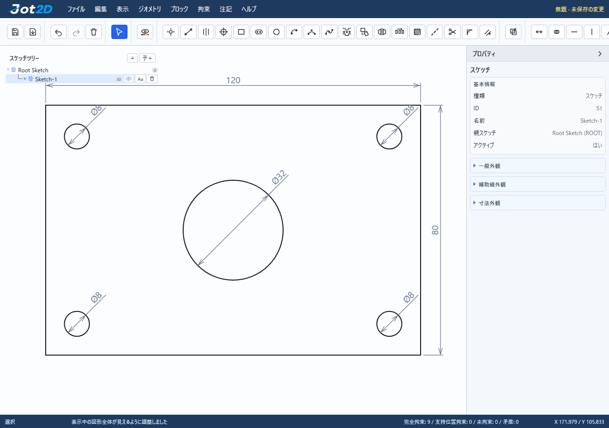

# 作図例：機械用取付プレート

[mounting-plate.jot2d](mounting-plate.jot2d)をJot2Dの「開く」で読み込めます。表示中の図形へフィットするにはCanvasをマウス中ボタンでダブルクリックします。

| 要素 | 寸法・位置（mm） |
| --- | --- |
| 外形 | 120 × 80、最初の角 (0, 0) |
| 中央穴 | Ø32、中心 (60, 40) |
| 取付穴 | 4 × Ø8、中心 (10, 10)、(110, 10)、(110, 70)、(10, 70) |

矩形toolのPropertiesで幅・高さを入力し、「位置を固定」を選んで作成します。円toolで中央穴を作り、直径を8へ変更後はX・Y座標だけを変えて4穴を追加します。外形と穴の9本のGeometryはすべて完全拘束で、寸法は後から編集できます。穴同士の寸法は独立しています。

これは平面形状と数値作図の操作例です。板厚、材質、公差、加工指示は定義していません。

同じ操作を検証するE2Eテストは`tests/e2e/numeric-drawing.spec.js`です。`JOT2D_WRITE_EXAMPLE=1`を指定してこのテストを実行すると作図例を再生成できます。
